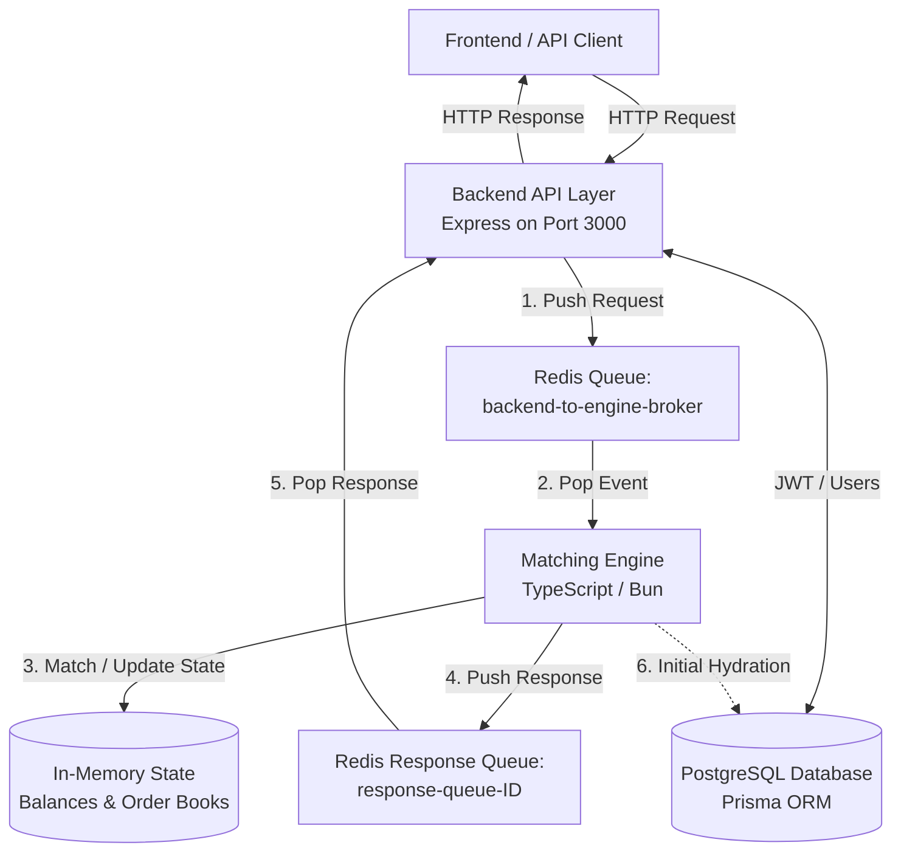

# Mini Centralized Exchange (CEX)

A high-performance, asynchronous, event-driven cryptocurrency exchange platform. The project is split into an API Gateway layer (`backend`) and an in-memory Trading Matching Engine (`engine`), communicating asynchronously via Redis queues.

---

## 🏗️ Architectural Overview

The architecture decouples HTTP request handling from real-time order matching and state management to prevent slow database queries and HTTP request latency from blocking the matching engine.



### 1. Backend Layer (API Gateway)
* **Technology**: Bun, Express.js, Prisma ORM, JWT, Zod.
* **Role**:
  * Exposes HTTP routes for user registration, login, and trading interactions.
  * Manages persistent database records (user profiles, credentials) using PostgreSQL.
  * Decouples the client requests by placing commands onto a Redis list and waiting on a unique, backend-instance-specific response queue (`response-queue-[ID]`).
  * Utilizes `correlationId` (UUID) to match engine responses back to the suspended client HTTP requests.

### 2. Message Broker (Redis)
* **Role**: Asynchronous, thread-safe communication broker.
* **Queues**:
  * **Incoming Queue**: `backend-to-engine-broker` processes engine-bound requests (e.g. `create_order`, `cancel_order`) in strict FIFO order.
  * **Response Queues**: Temporary, instance-specific queues created by each backend instance to receive responses back from the engine.

### 3. Matching & State Engine
* **Technology**: Bun, TypeScript, Redis.
* **Role**:
  * Avoids slow database writes or reads by maintaining all active orders, order books, and user balances strictly in RAM.
  * Processes messages pulled from the broker sequentially and **synchronously** to guarantee no race conditions.
  * **Hydration Phase**: Boots up by pulling the initial state (user balances and active orders) from PostgreSQL once, then running entirely in RAM.

---

## 📁 Repository Structure

```txt
cxe/
├── backend/                  # API Gateway service
│   ├── src/
│   │   ├── controllers/      # Express handlers (Auth, Exchange)
│   │   ├── routes/           # Endpoint paths & routers
│   │   ├── store/            # In-memory pending HTTP responses tracking
│   │   ├── utils/            # JWT, env parser, Redis connection manager
│   │   ├── index.ts          # Backend entrypoint
│   │   └── db.ts             # Prisma client instance
│   └── prisma/               # Schema and migrations
│
├── engine/                   # Trading Matching Engine service
│   ├── src/
│   │   ├── store/            # In-memory structures (Balances, Order Books)
│   │   ├── utils/            # Env parsers and validations
│   │   ├── OrderBook.ts      # Core matching algorithm and Bid/Ask queues
│   │   ├── engine.ts         # Main engine coordinator & queue listener loop
│   │   ├── index.ts          # Engine entrypoint & broker message handler
│   │   ├── types.ts          # Type declarations for internal objects
│   │   └── db.ts             # Initial hydration DB queries
│   └── test/                 # Test suites for matching engine
│
└── depth/                    # Draft client for external order books (WebSockets)
```

---

## 🔄 Data Transfer Protocols

### Backend to Engine Request

All requests sent to the engine share a unified JSON envelope:

```typescript
interface EngineRequest {
  correlationId: string;   // Unique UUID for request mapping
  responseQueue: string;   // Name of backend's response queue
  type:                    // Actions supported by the engine
    | "create_order"
    | "get_depth"
    | "get_user_balance"
    | "get_order"
    | "cancel_order";
  payload: Record<string, unknown>;
}
```

### Engine to Backend Response

Responses sent back via the backend's response queue:

```typescript
interface EngineResponse {
  correlationId: string;   // Must match the request correlationId
  ok: boolean;             // True if successful, false otherwise
  data?: unknown;          // Payload response from the engine matching core
  error?: string;          // Error details in case of failures
}
```

---

## ⚡ Matching & Order Book Rules

The core engine matches trades using standard centralized exchange rules:

* **Price-Time Priority**: Resting orders are sorted by price first (highest Bid first; lowest Ask first). If two orders share the same price, the order placed earlier gets matched first.
* **Match Validation**:
  * A `buy` limit order matches a resting `ask` when: $\text{Buy Price} \ge \text{Ask Price}$.
  * A `sell` limit order matches a resting `bid` when: $\text{Sell Price} \le \text{Bid Price}$.
* **Fills and Partial Fills**: Matches consume order quantities, generating `fill` records until the incoming order is either filled or the remaining quantity rests on the book.
* **Fund Locking**: To prevent double-spending, user balances are locked in RAM when they submit a resting limit order. For example, placing a buy order locks the user's base currency balance.

---

## 🚀 Setup & Execution

### Prerequisites
* [Bun Runtime](https://bun.sh/)
* Running [Redis Server](https://redis.io/)
* Running [PostgreSQL Instance](https://www.postgresql.org/)

### Quick Start

1. **Clone and Configure Environments**:
   ```bash
   cp backend/.env.example backend/.env
   cp engine/.env.example engine/.env
   ```

2. **Install Project Dependencies**:
   ```bash
   # In cxe/backend
   cd backend && bun install

   # In cxe/engine
   cd ../engine && bun install
   ```

3. **Bootstrap and Run**:
   ```bash
   # Run Redis Server
   redis-server

   # Run Engine (Terminal 1)
   cd engine && bun run dev

   # Run Backend (Terminal 2)
   cd backend && bun run dev
   ```

---

> [!TIP]
> Use [CHECK-FLOW.md](file:///Users/bombermac/cxe/CHECK-FLOW.md) to perform a smoke-test on the Redis queue roundtrip before starting matching engine development. Refer to [BARE_MINIMUM_TEST.md](file:///Users/bombermac/cxe/BARE_MINIMUM_TEST.md) for verifying exchange edge cases.
